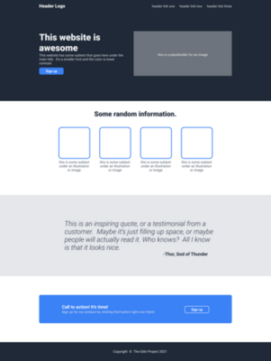
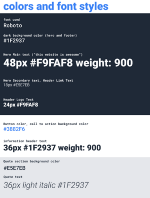

# odin-landing-page

Uses flexbox to implement the design provided by The Odin Project with the
provided colors and fonts:

|                             Full Design                              |                               Colors and Fonts                               |
| :------------------------------------------------------------------: | :--------------------------------------------------------------------------: |
|  |  |

The goal here was to see how well I could match the provided design without any starting code.

The images are all empty, but they are still `img` elements and rendering the
size correctly. I am more concerned with the code than with the design.
